#### IN THE NAME OF GOD
# Software Engineering Project
- Subject: OMFSDigital
- Student: Muhammad Javad Hassani

## UML Diagrams
### Client side
#### Orders Partition

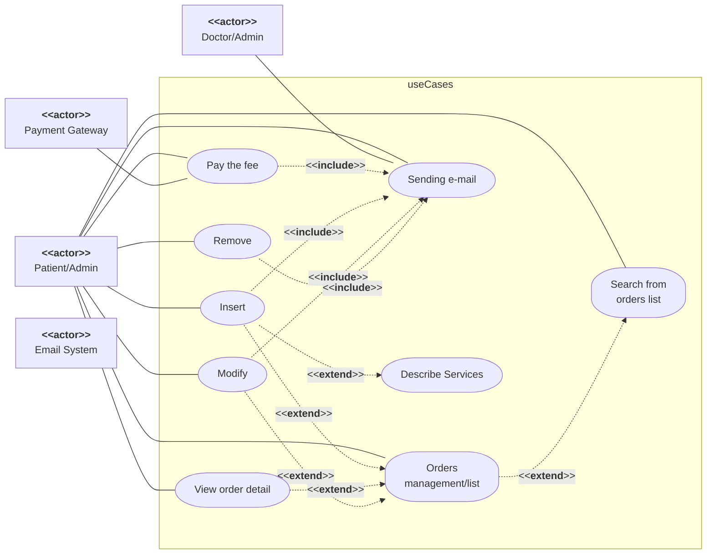
```mermaid 
graph LR 
    a1 --- a
    a1 --- c 
    a1 --- d 
    a1 --- h 
    a1 --- g 
    a1 --- e
    a1 --- b
    a1 --- f 
    a4 --- b
    a2 --- h
    subgraph useCases
    h -.->|"`<<**include**>>`"| b
    a -.->|"`<<**extend**>>`"| c
    a -.->|"`<<**extend**>>`"| i
    a -.->|"`<<**include**>>`"| b
    c -.->|"`<<**extend**>>`"| d
    e -.->|"`<<**extend**>>`"| c 
    f -.->|"`<<**extend**>>`"| c
    f -.->|"`<<**include**>>`"| b
    g -.->|"`<<**include**>>`"| b
    end
a[Insert]:::ellipse
i[Describe Services]:::ellipse
b[Sending e-mail]:::ellipse
c[Orders \n management/list]:::ellipse
d[Search from \n orders list]:::ellipse
e[View order detail]:::ellipse
f[Modify]:::ellipse
g[Remove]:::ellipse
h[Pay the fee]:::ellipse
a1["`
    **<<**actor**>>**
    Patient/Admin
`"]
a2["`
    **<<**actor**>>**
    Payment Gateway
`"]
a3["`
    **<<**actor**>>**
    Email System 
`"]
a4["`
    **<<**actor**>>**
    Doctor/Admin 
`"]
classDef actor fill:#f9f,stroke:#333,stroke-width:4px;
classDef ellipse ry:30px,rx:50px
```

#### Appointment Partition

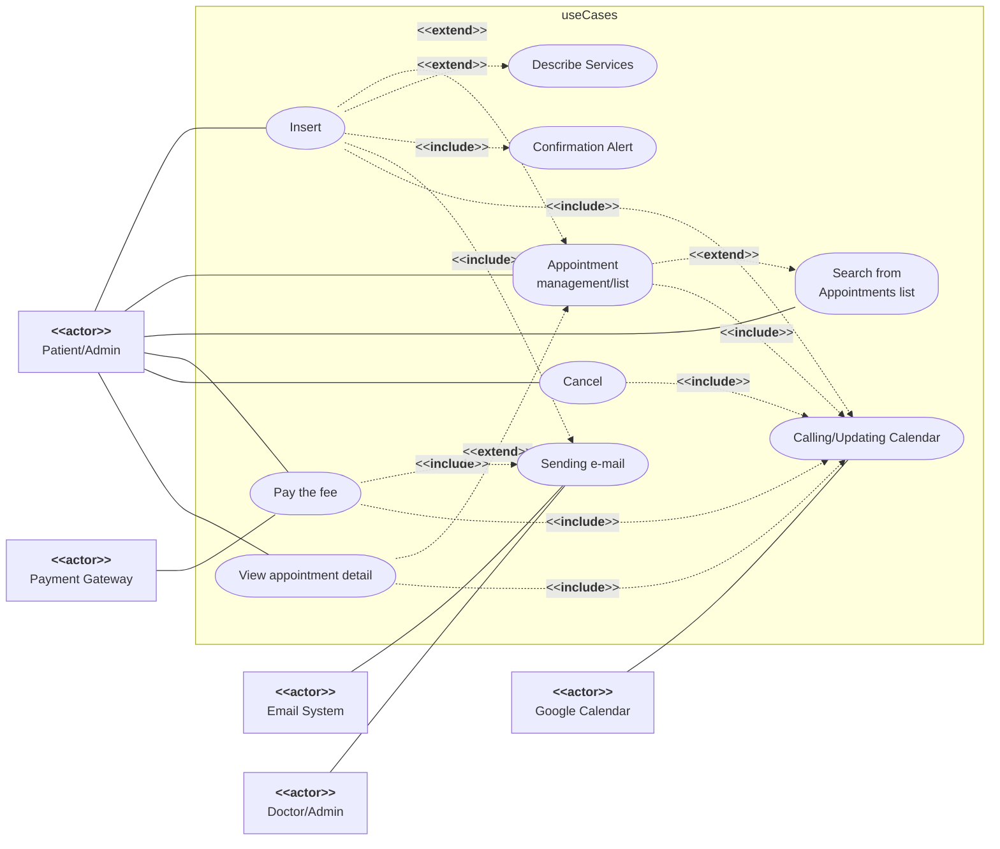
```mermaid 
graph LR 
    a1 --- a
    a1 --- c 
    a1 --- d 
    a1 --- h 
    a1 --- g 
    a1 --- e 
    a2 --- h
    a3 --- b
    a5 --- b
    a4 --- k

    subgraph useCases
    h -.->|"`<<**include**>>`"| b
    h -.->|"`<<**include**>>`"| k
    a -.->|"`<<**extend**>>`"| c
    a -.->|"`<<**extend**>>`"| i
    a -.->|"`<<**include**>>`"| j
    a -.->|"`<<**include**>>`"| b
    a -.->|"`<<**include**>>`"| k
    c -.->|"`<<**extend**>>`"| d
    c -.->|"`<<**include**>>`"| k
    e -.->|"`<<**extend**>>`"| c 
    e -.->|"`<<**include**>>`"| k
    g -.->|"`<<**include**>>`"| k
    end
a[Insert]:::ellipse
b[Sending e-mail]:::ellipse
c[Appointment \n management/list]:::ellipse
d[Search from \n Appointments list]:::ellipse
e[View appointment detail]:::ellipse
g[Cancel]:::ellipse
h[Pay the fee]:::ellipse
i[Describe Services]:::ellipse
j[Confirmation Alert]:::ellipse
k[Calling/Updating Calendar]:::ellipse
a1["`
    **<<**actor**>>**
    Patient/Admin
`"]
a2["`
    **<<**actor**>>**
    Payment Gateway
`"]
a3["`
    **<<**actor**>>**
    Email System 
`"]
a4["`
    **<<**actor**>>**
    Google Calendar 
`"]
a5["`
    **<<**actor**>>**
    Doctor/Admin 
`"]
classDef actor fill:#f9f,stroke:#333,stroke-width:4px;
classDef ellipse ry:30px,rx:50px
```
#### The remaining parts

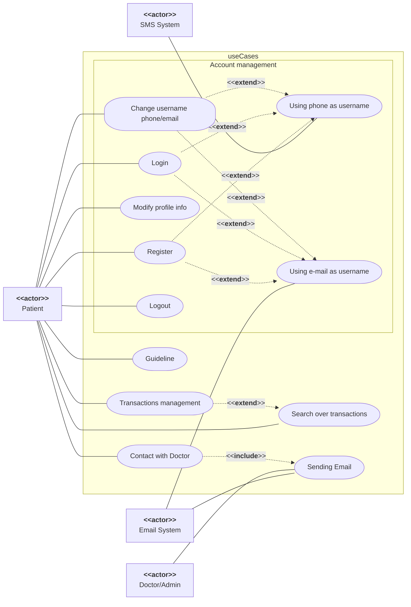
```mermaid 
graph LR 
    a1 --- a
    a1 --- h 
    a1 --- b 
    a1 --- c 
    a1 --- e 
    a1 --- f
    a1 --- i
    a1 --- j 
    a1 --- g
    a2 --- k
    a3 --- m
    a3 --- l
    a4 --- l
    subgraph useCases
    a
    h -.->|"`<<**include**>>`"| l
    subgraph Account management
        b -.->|"`<<**extend**>>`"| k
        b -.->|"`<<**extend**>>`"| m
        c -.->|"`<<**extend**>>`"| k
        c -.->|"`<<**extend**>>`"| m
        e
        f -.->|"`<<**extend**>>`"| k
        f -.->|"`<<**extend**>>`"| m
        g
    end 
    i -.->|"`<<**extend**>>`"| j


    
    end
a[Guideline]:::ellipse
h[Contact with Doctor]:::ellipse

b[Register]:::ellipse
c[Login]:::ellipse
e[Modify profile info]:::ellipse
f[Change username phone/email]:::ellipse
g[Logout]:::ellipse
k[Using phone as username]:::ellipse
m[Using e-mail as username]:::ellipse

i[Transactions management]:::ellipse
j[Search over transactions]:::ellipse

l[Sending Email]:::ellipse

a1["`
    **<<**actor**>>**
    Patient
`"]
a2["`
    **<<**actor**>>**
    SMS System 
`"]
a3["`
    **<<**actor**>>**
    Email System 
`"]
a4["`
    **<<**actor**>>**
    Doctor/Admin 
`"]
classDef actor fill:#f9f,stroke:#333,stroke-width:4px;
classDef ellipse ry:30px,rx:50px
```
### Administer Side
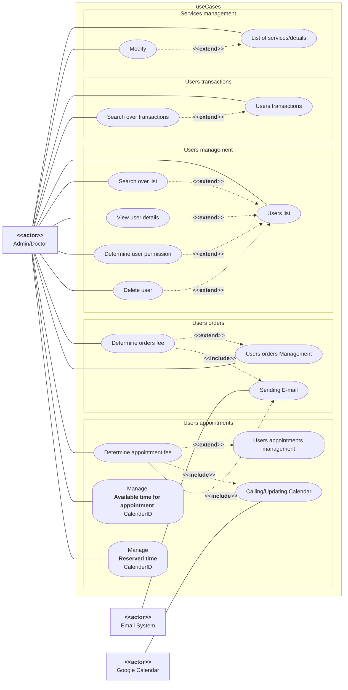
```mermaid 
graph LR 
    a1 --- a
    a1 --- f 
    a1 --- i 
    a1 --- j 
    a1 --- b 
    a1 --- c
    a1 --- e
    a1 --- h 
    a1 --- k
    a1 --- o1
    a1 --- o2
    a1 --- t1
    a1 --- t4
    a1 --- t5
    a3 --- email
    a2 --- t3
    subgraph useCases
        subgraph Services management
            f -.->|"`<<**extend**>>`"| a
        end
        subgraph Users transactions
            j -.->|"`<<**extend**>>`"| i
        end
        subgraph Users management
            c -.->|"`<<**extend**>>`"| b
            e -.->|"`<<**extend**>>`"| b
            h -.->|"`<<**extend**>>`"| b
            k -.->|"`<<**extend**>>`"| b
        end
        subgraph Users orders 
            o1 -.->|"`<<**extend**>>`"| o2 
            o1 -.->|"`<<**include**>>`"| email 
        end
        subgraph Users appointments 
            t1 -.->|"`<<**extend**>>`"| t2 
            t1 -.->|"`<<**include**>>`"| t3 
            t1 -.->|"`<<**include**>>`"| email 
            t4
            t5
        end

    end
a[List of services/details]:::ellipse
f[Modify]:::ellipse

i[Users transactions]:::ellipse
j[Search over transactions]:::ellipse

b[Users list]:::ellipse
c[Search over list]:::ellipse
e[View user details]:::ellipse
h[Determine user permission]:::ellipse
k[Delete user]:::ellipse

o1[Determine orders fee]:::ellipse
o2[Users orders Management]:::ellipse


t1[Determine appointment fee]:::ellipse
t2[Users appointments management]:::ellipse
t3[Calling/Updating Calendar]:::ellipse
t4["`
    Manage 
    **Available time for appointment** 
    CalenderID
`"]:::ellipse
t5["`
    Manage 
    **Reserved time** 
    CalenderID
    `"]:::ellipse

email[Sending E-mail]:::ellipse

a1["`
    **<<**actor**>>**
   Admin/Doctor 
`"]
a2["`
    **<<**actor**>>**
   Google Calendar 
`"]
a3["`
    **<<**actor**>>**
   Email System 
`"]

classDef actor fill:#f9f,stroke:#333,stroke-width:4px;
classDef ellipse ry:30px,rx:50px
```

## Class Diagrams
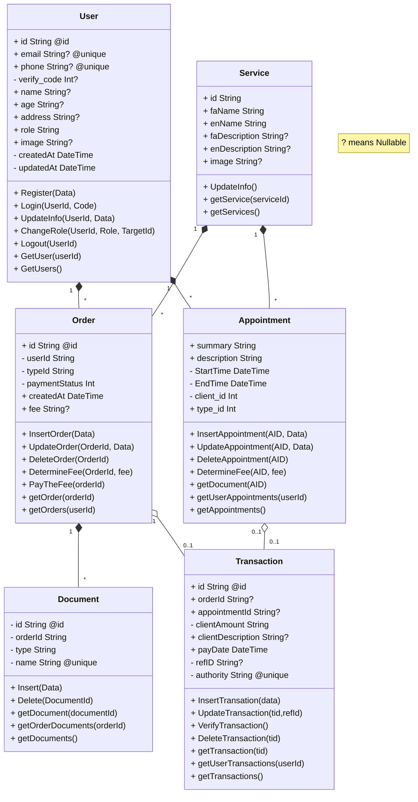
```mermaid
classDiagram
    note "? means Nullable"
    class User {
        + id String @id 
        + email String? @unique
        + phone String? @unique
        - verify_code Int?
        + name String?
        + age String?
        + address String?
        + role String 
        + image String?
        - createdAt DateTime  
        - updatedAt DateTime  
        + Register(Data)
        + Login(UserId, Code)
        + UpdateInfo(UserId, Data)
        + ChangeRole(UserId, Role, TargetId)
        + Logout(UserId)
        + GetUser(userId)
        + GetUsers()

    }
    class Service {
        + id String
        + faName String 
        + enName String 
        + faDescription String? 
        + enDescription String? 
        + image String?
        + UpdateInfo()
        + getService(serviceId)
        + getServices()
    }
    class Order{
        + id String @id 
        - userId String 
        - typeId String
        - paymentStatus Int 
        + createdAt DateTime
        + fee String?
        + InsertOrder(Data)
        + UpdateOrder(OrderId, Data)
        + DeleteOrder(OrderId)
        + DetermineFee(OrderId, fee)
        + PayTheFee(orderId)
        + getOrder(orderId)
        + getOrders(userId)
    }
    class Document {
        - id String @id 
        - orderId String 
        - type String
        - name String @unique
        + Insert(Data)
        + Delete(DocumentId)
        + getDocument(documentId)
        + getOrderDocuments(orderId)
        + getDocuments()
    }
    class Appointment {
        + summary String
        + description String
        - StartTime DateTime
        - EndTime DateTime
        - client_id Int
        + type_id Int
        + InsertAppointment(AID, Data)
        + UpdateAppointment(AID, Data)
        + DeleteAppointment(AID)
        + DetermineFee(AID, fee)
        + getDocument(AID)
        + getUserAppointments(userId)
        + getAppointments()
    }
    class Transaction {
        + id String @id 
        + orderId String? 
        + appointmentId String? 
        - clientAmount String
        + clientDescription String?
        + payDate DateTime 
        - refID String?
        - authority String @unique
        + InsertTransation(data)
        + UpdateTransaction(tid,refId)
        + VerifyTransaction()
        + DeleteTransaction(tid)
        + getTransaction(tid)
        + getUserTransactions(userId)
        + getTransactions()
    }
    User "1" *-- "*"  Order
    Service "1" *-- "*" Order
    Order "1" *-- "*" Document
    Order "0..1" o-- "0..1" Transaction

    User "1" *-- "*" Appointment 
    Service "1" *-- "*" Appointment 
    Appointment "0..1" o-- "0..1" Transaction


```
## Interface Model
Guideline
---

Contact with Doctor
---
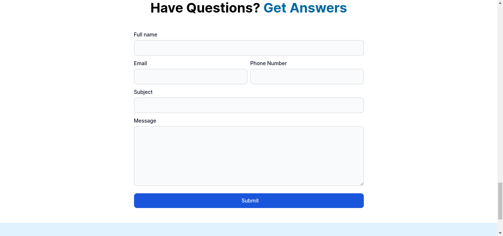

Register/Login
---
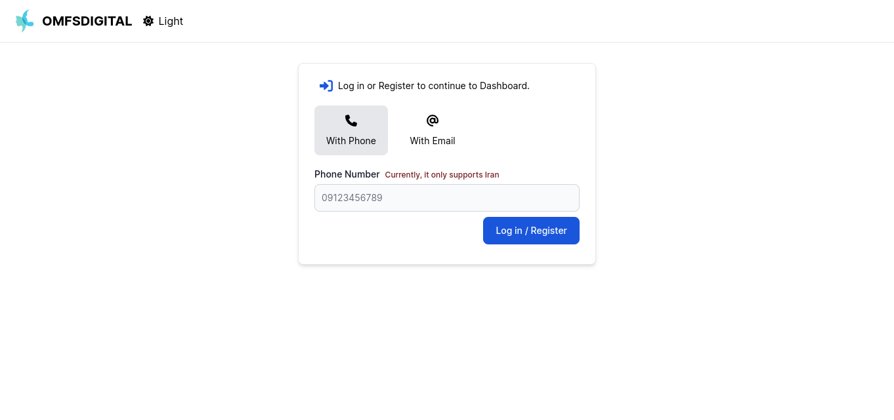

Modify profile info
---
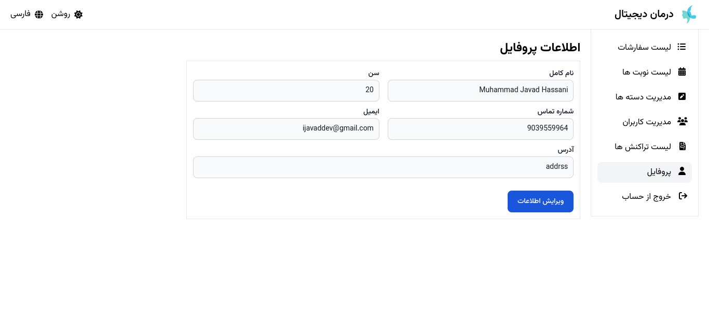

Logout
---
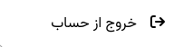

Transactions management/ Search over transactions
---
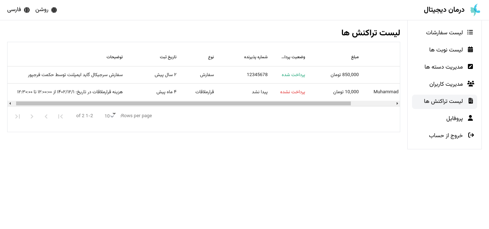

List of services/details
---
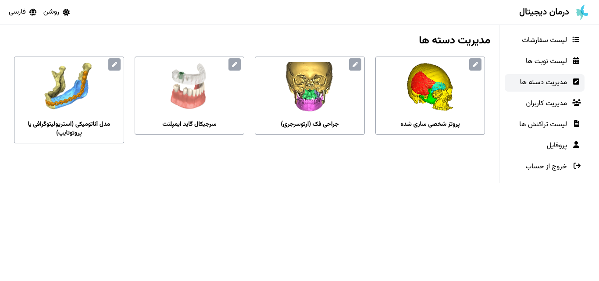

Modify Service
---
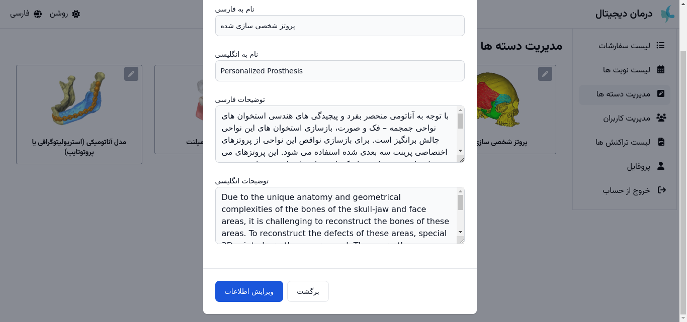

Sending e-mail
---
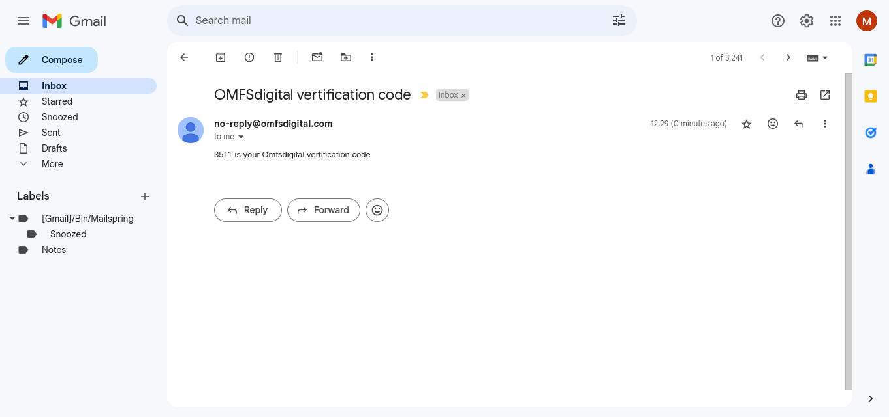

### Users 
Users list / Search
---
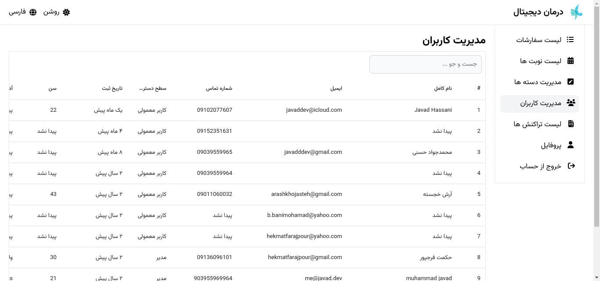

View user details / Determine user permission 
---
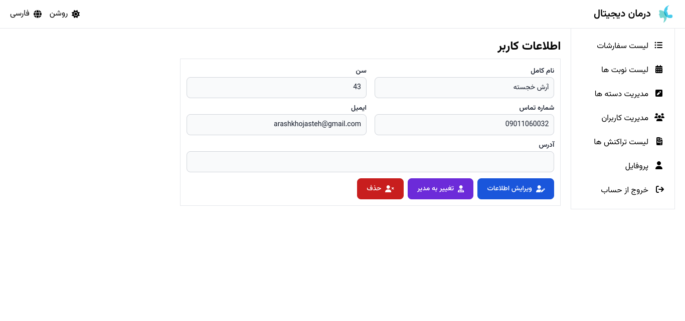

### Orders
Orders management / Search
---

Describe Services in insert usercase
---
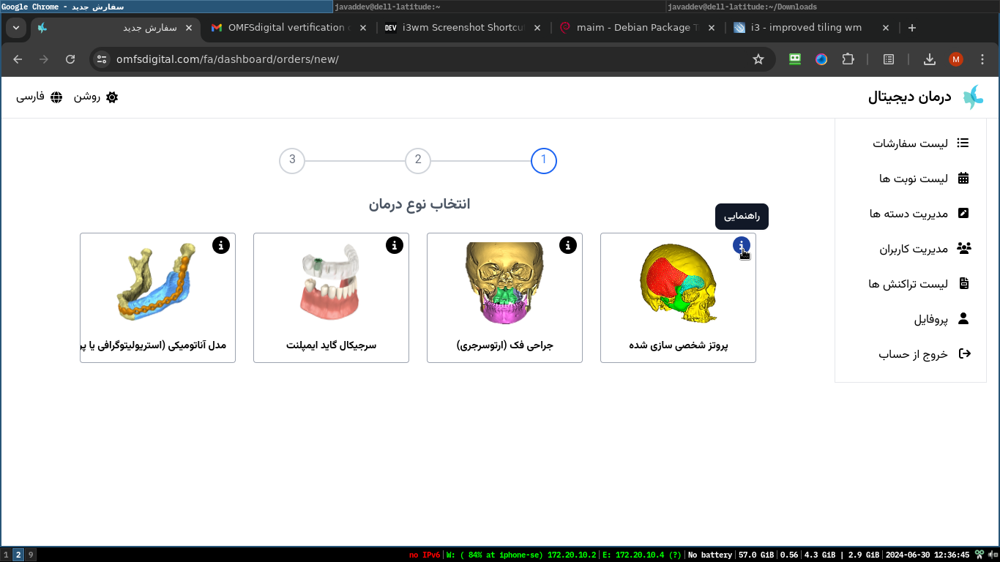
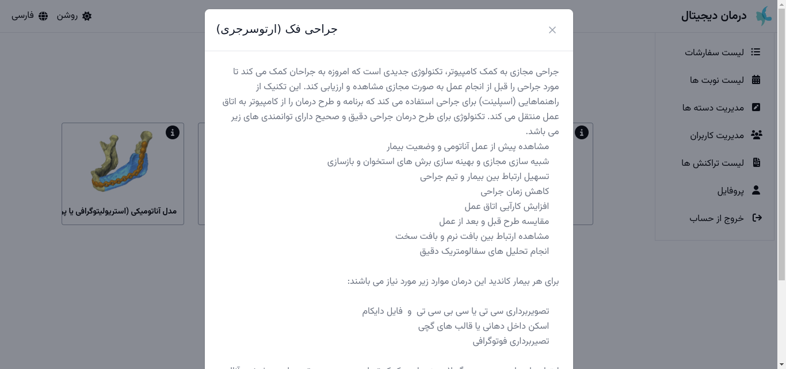

Insert order
---
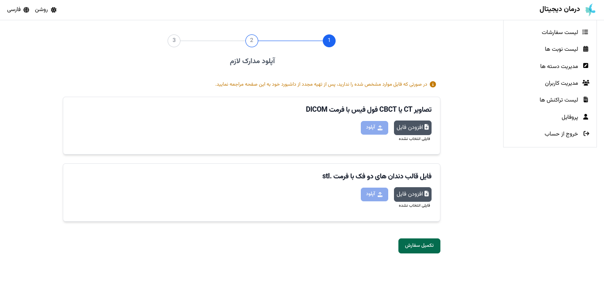

View order detail
---
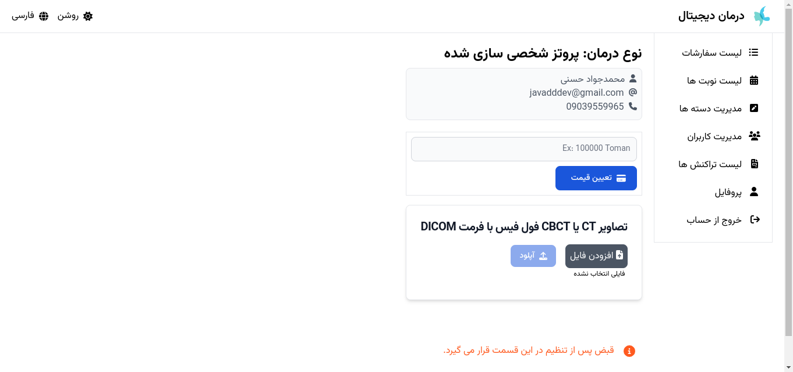

Modify/Remove/Pay the fee/Determine order fee
---
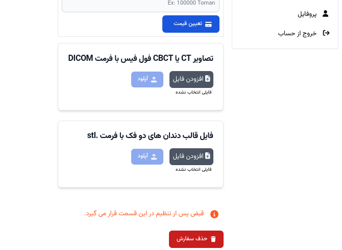

### Apointments
Appointment  management / Search
---
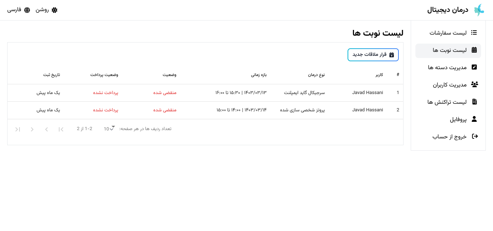

Insert
---
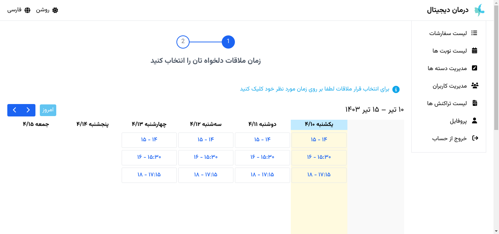

View appointment detail / Cancel / Pay the fee / Determine appointment fee
---
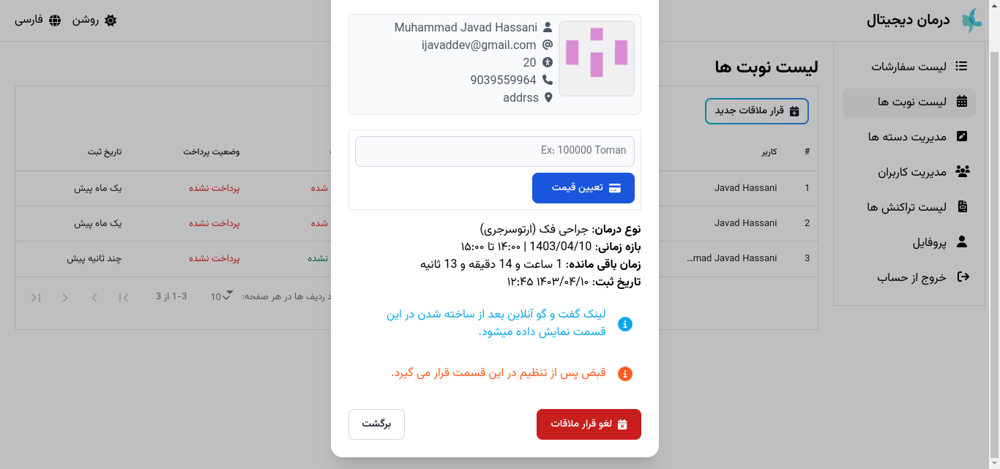

Confirmation Alert
---
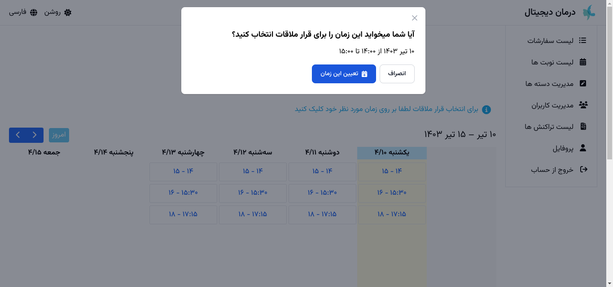

## Sequence Diagrams
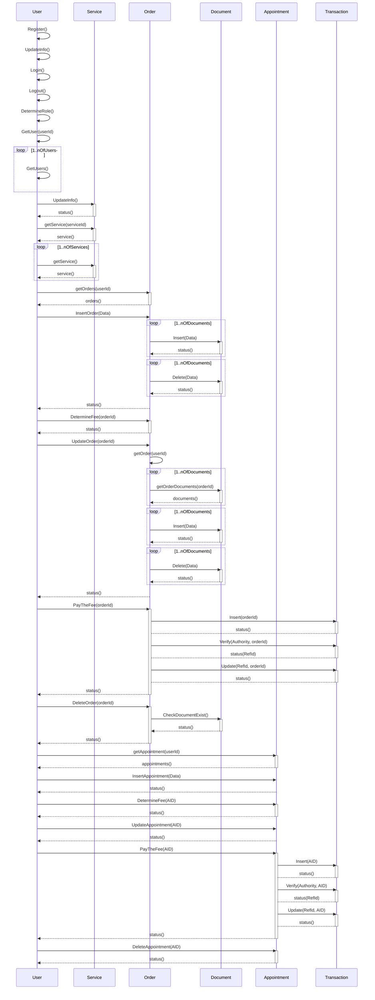
```mermaid
sequenceDiagram
participant User
participant Service
participant Order
participant Document 
participant Appointment 
participant Transaction 
User ->> User: Register()
User ->> User: UpdateInfo()
User ->> User: Login()
User ->> User: Logout()
User ->> User: DetermineRole()

User ->> User: GetUser(userId)
loop 1..nOfUsers
User ->> User: GetUsers()
end

User ->> Service: UpdateInfo()
activate Service
Service -->> User: status()
deactivate Service

User ->> Service: getService(serviceId)
activate Service
Service -->> User: service()
deactivate Service

loop 1..nOfServices
User ->> Service: getService()
activate Service
Service -->> User: service()
deactivate Service
end


User ->> Order: getOrders(userId);
activate Order
Order -->> User: orders();
deactivate Order


User ->> Order: InsertOrder(Data)
loop 1..nOfDocuments
Order ->> Document: Insert(Data)
activate Document
Document -->> Order: status()
deactivate Document
end

loop 1..nOfDocuments
Order ->> Document: Delete(Data)
activate Document
Document -->> Order: status()
deactivate Document
end

Order -->> User: status()

User ->> Order: DetermineFee(orderId);
activate Order
Order -->> User: status();
deactivate Order

User ->> Order: UpdateOrder(orderId)

Order ->> Order: getOrder(userId)
loop 1..nOfDocuments
Order ->> Document: getOrderDocuments(orderId)
activate Document
Document -->> Order: documents()
deactivate Document
end

loop 1..nOfDocuments
Order ->> Document: Insert(Data)
activate Document
Document -->> Order: status()
deactivate Document
end

loop 1..nOfDocuments
Order ->> Document: Delete(Data)
activate Document
Document -->> Order: status()
deactivate Document
end
Order -->> User: status()


User ->> Order: PayTheFee(orderId)
activate Order

Order ->> Transaction: Insert(orderId)
activate Transaction
Transaction --> Order: status()
deactivate Transaction

Order ->> Transaction: Verify(Authority, orderId)
activate Transaction
Transaction --> Order: status(RefId)
deactivate Transaction

Order ->> Transaction: Update(RefId, orderId)
activate Transaction
Transaction --> Order: status()
deactivate Transaction

Order -->> User: status()
deactivate Order


User ->> Order: DeleteOrder(orderId)
activate Order
Order ->> Document: CheckDocumentExist()  
activate Document
Document -->> Order: status()
deactivate Document
Order -->> User: status()
deactivate Order


User ->> Appointment: getAppointment(userId);
activate Appointment 
Appointment -->> User: appointments();
deactivate Appointment 


User ->> Appointment: InsertAppointment(Data)
Appointment -->> User: status()

User ->> Appointment: DetermineFee(AID);
activate Appointment
Appointment -->> User: status();
deactivate Appointment

User ->> Appointment: UpdateAppointment(AID)
Appointment -->> User: status()


User ->> Appointment: PayTheFee(AID)
activate Appointment 

Appointment ->> Transaction: Insert(AID)
activate Transaction
Transaction --> Appointment: status()
deactivate Transaction

Appointment ->> Transaction: Verify(Authority, AID)
activate Transaction
Transaction --> Appointment: status(RefId)
deactivate Transaction

Appointment ->> Transaction: Update(RefId, AID)
activate Transaction
Transaction --> Appointment: status()
deactivate Transaction

Appointment -->> User: status()
deactivate Appointment


User ->> Appointment: DeleteAppointment(AID)
activate Appointment
Appointment -->> User: status()
deactivate Appointment

```

## Deployment Diagram
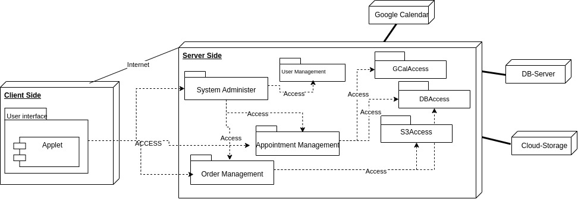

