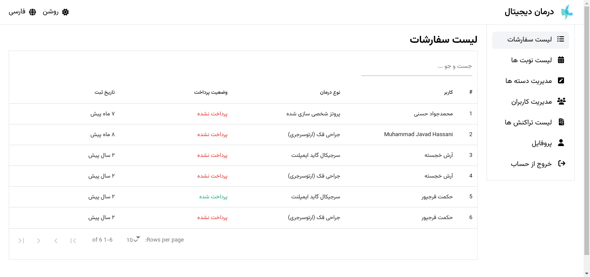

#### IN THE NAME OF GOD
# Software Engineering Project
- Subject: OMFSDigital
- Student: Muhammad Javad Hassani

## UML Diagrams
### Client side
#### Orders Partition

#### Appointment Partition

#### The remaining parts

### Administer Side

## Class Diagrams

## Interface Model
Guideline
---

Contact with Doctor
---

Register/Login
---

Modify profile info
---

Logout
---

Transactions management/ Search over transactions
---

List of services/details
---

Modify Service
---

Sending e-mail
---

### Users 
Users list / Search
---

View user details / Determine user permission 
---

### Orders
Orders management / Search
---

Describe Services in insert usercase
---

Insert order
---

View order detail
---

Modify/Remove/Pay the fee/Determine order fee
---

### Apointments
Appointment  management / Search
---

Insert
---

View appointment detail / Cancel / Pay the fee / Determine appointment fee
---

Confirmation Alert
---

## Sequence Diagrams

## Deployment Diagram

