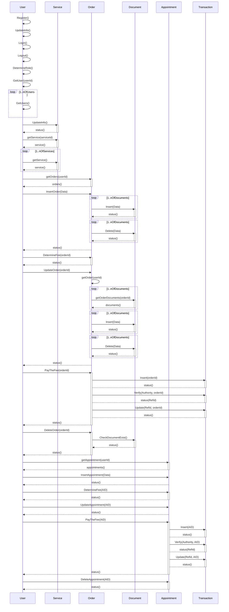

# Sequence Diagrams

```mermaid
sequenceDiagram
participant User
participant Service
participant Order
participant Document 
participant Appointment 
participant Transaction 
User ->> User: Register()
User ->> User: UpdateInfo()
User ->> User: Login()
User ->> User: Logout()
User ->> User: DetermineRole()

User ->> User: GetUser(userId)
loop 1..nOfUsers
User ->> User: GetUsers()
end

User ->> Service: UpdateInfo()
activate Service
Service -->> User: status()
deactivate Service

User ->> Service: getService(serviceId)
activate Service
Service -->> User: service()
deactivate Service

loop 1..nOfServices
User ->> Service: getService()
activate Service
Service -->> User: service()
deactivate Service
end


User ->> Order: getOrders(userId);
activate Order
Order -->> User: orders();
deactivate Order


User ->> Order: InsertOrder(Data)
loop 1..nOfDocuments
Order ->> Document: Insert(Data)
activate Document
Document -->> Order: status()
deactivate Document
end

loop 1..nOfDocuments
Order ->> Document: Delete(Data)
activate Document
Document -->> Order: status()
deactivate Document
end

Order -->> User: status()

User ->> Order: DetermineFee(orderId);
activate Order
Order -->> User: status();
deactivate Order

User ->> Order: UpdateOrder(orderId)

Order ->> Order: getOrder(userId)
loop 1..nOfDocuments
Order ->> Document: getOrderDocuments(orderId)
activate Document
Document -->> Order: documents()
deactivate Document
end

loop 1..nOfDocuments
Order ->> Document: Insert(Data)
activate Document
Document -->> Order: status()
deactivate Document
end

loop 1..nOfDocuments
Order ->> Document: Delete(Data)
activate Document
Document -->> Order: status()
deactivate Document
end
Order -->> User: status()


User ->> Order: PayTheFee(orderId)
activate Order

Order ->> Transaction: Insert(orderId)
activate Transaction
Transaction --> Order: status()
deactivate Transaction

Order ->> Transaction: Verify(Authority, orderId)
activate Transaction
Transaction --> Order: status(RefId)
deactivate Transaction

Order ->> Transaction: Update(RefId, orderId)
activate Transaction
Transaction --> Order: status()
deactivate Transaction

Order -->> User: status()
deactivate Order


User ->> Order: DeleteOrder(orderId)
activate Order
Order ->> Document: CheckDocumentExist()  
activate Document
Document -->> Order: status()
deactivate Document
Order -->> User: status()
deactivate Order


User ->> Appointment: getAppointment(userId);
activate Appointment 
Appointment -->> User: appointments();
deactivate Appointment 


User ->> Appointment: InsertAppointment(Data)
Appointment -->> User: status()

User ->> Appointment: DetermineFee(AID);
activate Appointment
Appointment -->> User: status();
deactivate Appointment

User ->> Appointment: UpdateAppointment(AID)
Appointment -->> User: status()


User ->> Appointment: PayTheFee(AID)
activate Appointment 

Appointment ->> Transaction: Insert(AID)
activate Transaction
Transaction --> Appointment: status()
deactivate Transaction

Appointment ->> Transaction: Verify(Authority, AID)
activate Transaction
Transaction --> Appointment: status(RefId)
deactivate Transaction

Appointment ->> Transaction: Update(RefId, AID)
activate Transaction
Transaction --> Appointment: status()
deactivate Transaction

Appointment -->> User: status()
deactivate Appointment


User ->> Appointment: DeleteAppointment(AID)
activate Appointment
Appointment -->> User: status()
deactivate Appointment

```

