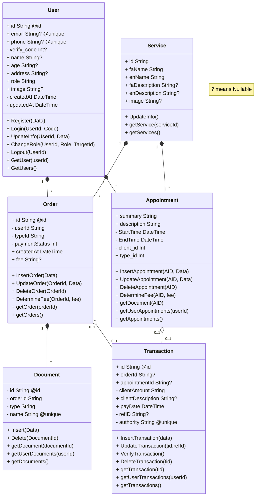

# Class Diagrams

```mermaid
classDiagram
    note "? means Nullable"
    class User {
        + id String @id 
        + email String? @unique
        + phone String? @unique
        - verify_code Int?
        + name String?
        + age String?
        + address String?
        + role String 
        + image String?
        - createdAt DateTime  
        - updatedAt DateTime  
        + Register(Data)
        + Login(UserId, Code)
        + UpdateInfo(UserId, Data)
        + ChangeRole(UserId, Role, TargetId)
        + Logout(UserId)
        + GetUser(userId)
        + GetUsers()

    }
    class Service {
        + id String
        + faName String 
        + enName String 
        + faDescription String? 
        + enDescription String? 
        + image String?
        + UpdateInfo()
        + getService(serviceId)
        + getServices()
    }
    class Order{
        + id String @id 
        - userId String 
        - typeId String
        - paymentStatus Int 
        + createdAt DateTime
        + fee String?
        + InsertOrder(Data)
        + UpdateOrder(OrderId, Data)
        + DeleteOrder(OrderId)
        + DetermineFee(OrderId, fee)
        + getOrder(orderId)
        + getOrders()
    }
    class Document {
        - id String @id 
        - orderId String 
        - type String
        - name String @unique
        + Insert(Data)
        + Delete(DocumentId)
        + getDocument(documentId)
        + getUserDocuments(userId)
        + getDocuments()
    }
    class Appointment {
        + summary String
        + description String
        - StartTime DateTime
        - EndTime DateTime
        - client_id Int
        + type_id Int
        + InsertAppointment(AID, Data)
        + UpdateAppointment(AID, Data)
        + DeleteAppointment(AID)
        + DetermineFee(AID, fee)
        + getDocument(AID)
        + getUserAppointments(userId)
        + getAppointments()
    }
    class Transaction {
        + id String @id 
        + orderId String? 
        + appointmentId String? 
        - clientAmount String
        + clientDescription String?
        + payDate DateTime 
        - refID String?
        - authority String @unique
        + InsertTransation(data)
        + UpdateTransaction(tid,refId)
        + VerifyTransaction()
        + DeleteTransaction(tid)
        + getTransaction(tid)
        + getUserTransactions(userId)
        + getTransactions()
    }
    User "1" *-- "*"  Order
    Service "1" *-- "*" Order
    Order "1" *-- "*" Document
    Order "0..1" o-- "0..1" Transaction

    User "1" *-- "*" Appointment 
    Service "1" *-- "*" Appointment 
    Appointment "0..1" o-- "0..1" Transaction


```
