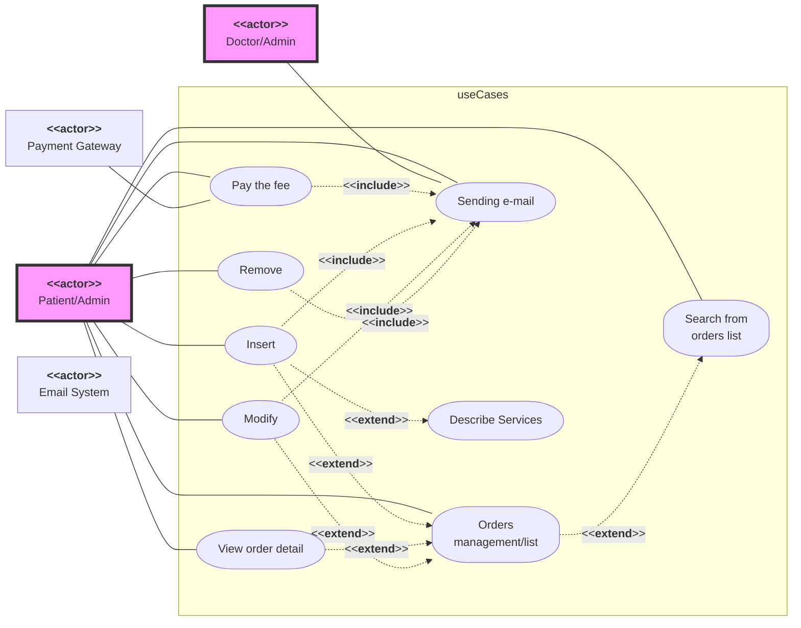
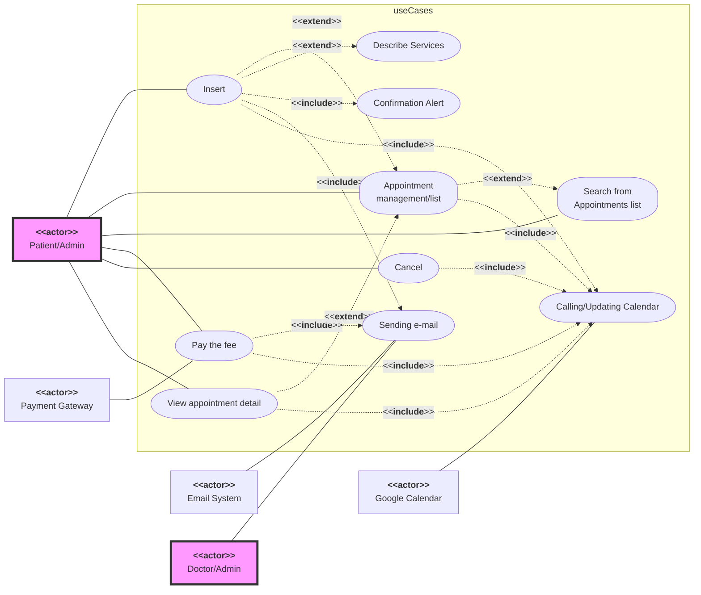
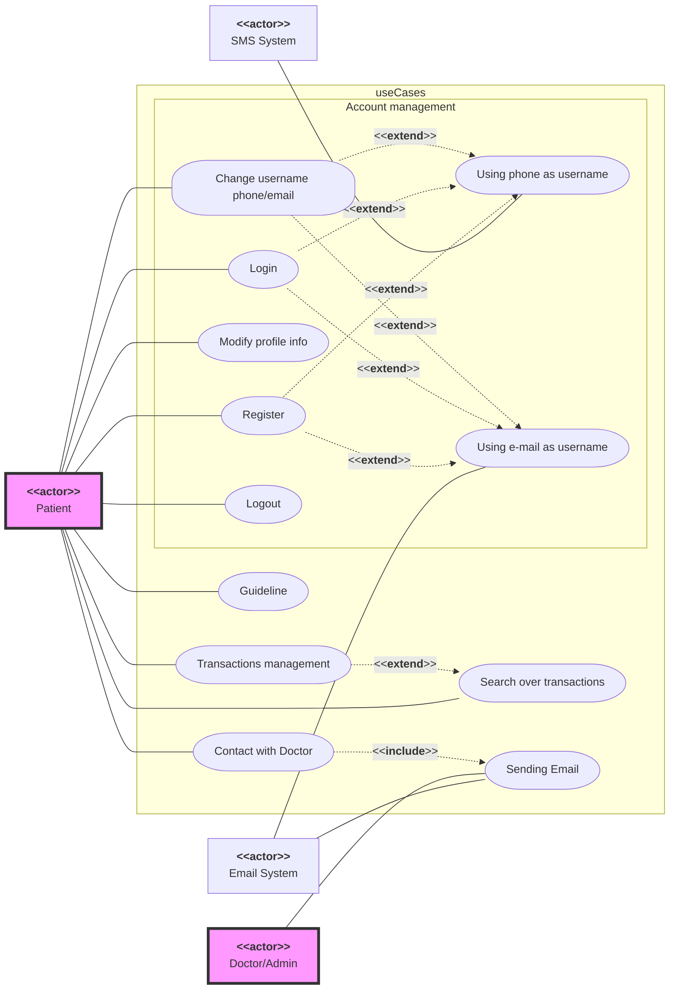
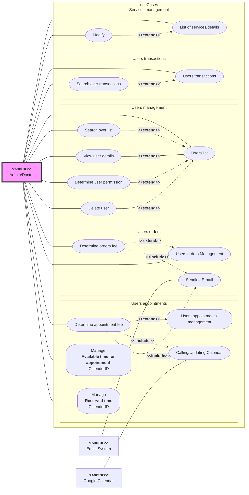

# UML Diagrams
## Client side
### Orders Partition

```mermaid 
graph LR 
    a1 --- a
    a1 --- c 
    a1 --- d 
    a1 --- h 
    a1 --- g 
    a1 --- e
    a1 --- b
    a1 --- f 
    a4 --- b
    a2 --- h
    subgraph useCases
    h -.->|"`<<**include**>>`"| b
    a -.->|"`<<**extend**>>`"| c
    a -.->|"`<<**extend**>>`"| i
    a -.->|"`<<**include**>>`"| b
    c -.->|"`<<**extend**>>`"| d
    e -.->|"`<<**extend**>>`"| c 
    f -.->|"`<<**extend**>>`"| c
    f -.->|"`<<**include**>>`"| b
    g -.->|"`<<**include**>>`"| b
    end
a[Insert]:::ellipse
i[Describe Services]:::ellipse
b[Sending e-mail]:::ellipse
c[Orders \n management/list]:::ellipse
d[Search from \n orders list]:::ellipse
e[View order detail]:::ellipse
f[Modify]:::ellipse
g[Remove]:::ellipse
h[Pay the fee]:::ellipse
a1["`
    **<<**actor**>>**
    Patient/Admin
`"]
a2["`
    **<<**actor**>>**
    Payment Gateway
`"]
a3["`
    **<<**actor**>>**
    Email System 
`"]
a4["`
    **<<**actor**>>**
    Doctor/Admin 
`"]
classDef actor fill:#f9f,stroke:#333,stroke-width:4px;
classDef ellipse ry:30px,rx:50px
class a1,a4 actor 
```

### Appointment Partition

```mermaid 
graph LR 
    a1 --- a
    a1 --- c 
    a1 --- d 
    a1 --- h 
    a1 --- g 
    a1 --- e 
    a2 --- h
    a3 --- b
    a5 --- b
    a4 --- k

    subgraph useCases
    h -.->|"`<<**include**>>`"| b
    h -.->|"`<<**include**>>`"| k
    a -.->|"`<<**extend**>>`"| c
    a -.->|"`<<**extend**>>`"| i
    a -.->|"`<<**include**>>`"| j
    a -.->|"`<<**include**>>`"| b
    a -.->|"`<<**include**>>`"| k
    c -.->|"`<<**extend**>>`"| d
    c -.->|"`<<**include**>>`"| k
    e -.->|"`<<**extend**>>`"| c 
    e -.->|"`<<**include**>>`"| k
    g -.->|"`<<**include**>>`"| k
    end
a[Insert]:::ellipse
b[Sending e-mail]:::ellipse
c[Appointment \n management/list]:::ellipse
d[Search from \n Appointments list]:::ellipse
e[View appointment detail]:::ellipse
g[Cancel]:::ellipse
h[Pay the fee]:::ellipse
i[Describe Services]:::ellipse
j[Confirmation Alert]:::ellipse
k[Calling/Updating Calendar]:::ellipse
a1["`
    **<<**actor**>>**
    Patient/Admin
`"]
a2["`
    **<<**actor**>>**
    Payment Gateway
`"]
a3["`
    **<<**actor**>>**
    Email System 
`"]
a4["`
    **<<**actor**>>**
    Google Calendar 
`"]
a5["`
    **<<**actor**>>**
    Doctor/Admin 
`"]
classDef actor fill:#f9f,stroke:#333,stroke-width:4px;
classDef ellipse ry:30px,rx:50px
class a1,a5 actor 
```
### The remaining parts

```mermaid 
graph LR 
    a1 --- a
    a1 --- h 
    a1 --- b 
    a1 --- c 
    a1 --- e 
    a1 --- f
    a1 --- i
    a1 --- j 
    a1 --- g
    a2 --- k
    a3 --- m
    a3 --- l
    a4 --- l
    subgraph useCases
    a
    h -.->|"`<<**include**>>`"| l
    subgraph Account management
        b -.->|"`<<**extend**>>`"| k
        b -.->|"`<<**extend**>>`"| m
        c -.->|"`<<**extend**>>`"| k
        c -.->|"`<<**extend**>>`"| m
        e
        f -.->|"`<<**extend**>>`"| k
        f -.->|"`<<**extend**>>`"| m
        g
    end 
    i -.->|"`<<**extend**>>`"| j


    
    end
a[Guideline]:::ellipse
h[Contact with Doctor]:::ellipse

b[Register]:::ellipse
c[Login]:::ellipse
e[Modify profile info]:::ellipse
f[Change username phone/email]:::ellipse
g[Logout]:::ellipse
k[Using phone as username]:::ellipse
m[Using e-mail as username]:::ellipse

i[Transactions management]:::ellipse
j[Search over transactions]:::ellipse

l[Sending Email]:::ellipse

a1["`
    **<<**actor**>>**
    Patient
`"]
a2["`
    **<<**actor**>>**
    SMS System 
`"]
a3["`
    **<<**actor**>>**
    Email System 
`"]
a4["`
    **<<**actor**>>**
    Doctor/Admin 
`"]
classDef actor fill:#f9f,stroke:#333,stroke-width:4px;
classDef ellipse ry:30px,rx:50px
class a1,a4 actor 
```
## Administer Side

```mermaid 
graph LR 
    a1 --- a
    a1 --- f 
    a1 --- i 
    a1 --- j 
    a1 --- b 
    a1 --- c
    a1 --- e
    a1 --- h 
    a1 --- k
    a1 --- o1
    a1 --- o2
    a1 --- t1
    a1 --- t4
    a1 --- t5
    a3 --- email
    a2 --- t3
    subgraph useCases
        subgraph Services management
            f -.->|"`<<**extend**>>`"| a
        end
        subgraph Users transactions
            j -.->|"`<<**extend**>>`"| i
        end
        subgraph Users management
            c -.->|"`<<**extend**>>`"| b
            e -.->|"`<<**extend**>>`"| b
            h -.->|"`<<**extend**>>`"| b
            k -.->|"`<<**extend**>>`"| b
        end
        subgraph Users orders 
            o1 -.->|"`<<**extend**>>`"| o2 
            o1 -.->|"`<<**include**>>`"| email 
        end
        subgraph Users appointments 
            t1 -.->|"`<<**extend**>>`"| t2 
            t1 -.->|"`<<**include**>>`"| t3 
            t1 -.->|"`<<**include**>>`"| email 
            t4
            t5
        end

    end
a[List of services/details]:::ellipse
f[Modify]:::ellipse

i[Users transactions]:::ellipse
j[Search over transactions]:::ellipse

b[Users list]:::ellipse
c[Search over list]:::ellipse
e[View user details]:::ellipse
h[Determine user permission]:::ellipse
k[Delete user]:::ellipse

o1[Determine orders fee]:::ellipse
o2[Users orders Management]:::ellipse


t1[Determine appointment fee]:::ellipse
t2[Users appointments management]:::ellipse
t3[Calling/Updating Calendar]:::ellipse
t4["`
    Manage 
    **Available time for appointment** 
    CalenderID
`"]:::ellipse
t5["`
    Manage 
    **Reserved time** 
    CalenderID
    `"]:::ellipse

email[Sending E-mail]:::ellipse

a1["`
    **<<**actor**>>**
   Admin/Doctor 
`"]
a2["`
    **<<**actor**>>**
   Google Calendar 
`"]
a3["`
    **<<**actor**>>**
   Email System 
`"]

classDef actor fill:#f9f,stroke:#333,stroke-width:4px;
classDef ellipse ry:30px,rx:50px
class a1 actor 
```
